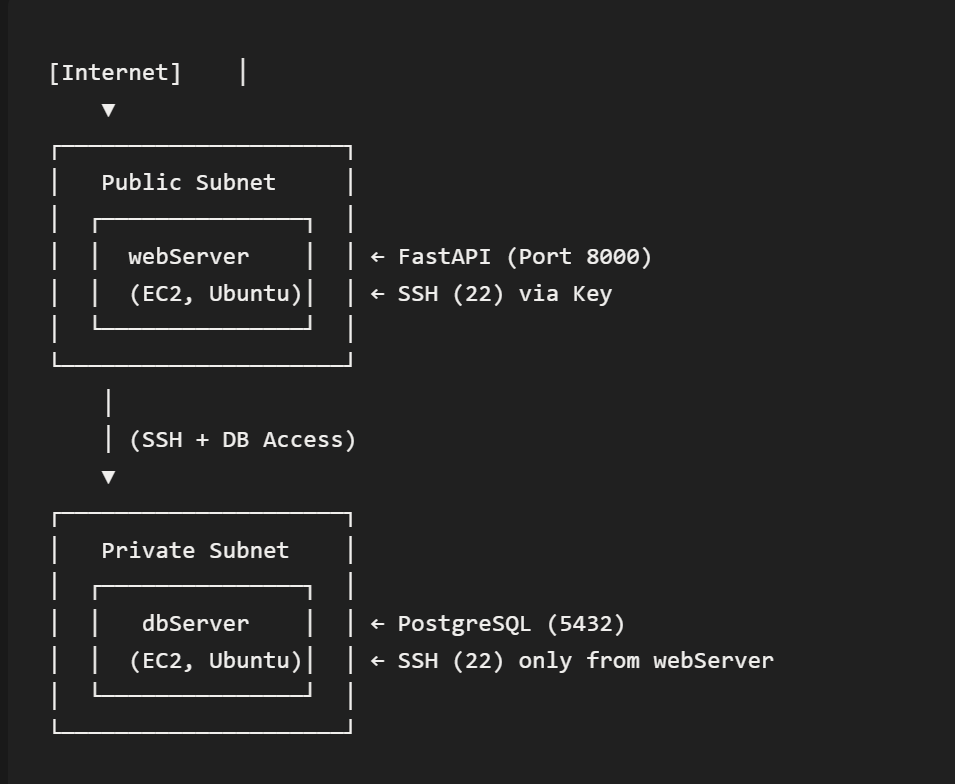

# 🌲 Amazon Forest — AWS 2-Tier Architecture
<p align="center"></p>
## Overview
Replication of the LearningSteps two-tier architecture on **Amazon Web Services** to validate cross-platform cloud security skills. This project represents Part 2 of a three-part cloud security series.

**Original Curriculum:** [CyberstepsDE/learningsteps](https://github.com/CyberstepsDE/learningsteps)  
**My Implementation:** AWS equivalent with VPC, Security Groups, EC2 instances, Elastic IPs, PostgreSQL.

---

## 🎯 Objective
Deploy the same FastAPI + PostgreSQL journal application on AWS with identical security principles:
- Public-facing API tier (EC2 web server)
- Isolated database tier (EC2 private VM)
- Network security via Security Groups

---

## 🏗️ Architecture Comparison

| Azure | AWS |
|-------|-----|
| Virtual Network (VNet) | Virtual Private Cloud (VPC) |
| Subnets (Public/Private) | Subnets (Public/Private) |
| NSGs | Security Groups |
| Public/Private IP | Public/Elastic IP |
| Jump host pattern | Same SSH key chain |

**Network:** 10.0.0.0/16 (same CIDR as Azure version)

---

## 🔒 Security Implementation

### Public Subnet (API Tier)
| Rule | Purpose |
|------|---------|
| SSH (22) — key-based only | Admin access |
| HTTP (8000) — internet | API endpoint |

### Private Subnet (Database Tier)
| Rule | Purpose |
|------|---------|
| SSH (22) — from API VM only | Admin access |
| PostgreSQL (5432) — from API VM only | Database access |

---

## 🛠️ Key Implementation Steps

1. **VPC Creation**
   - Created VPC with public and private subnets
   - Configured route tables for internet access

2. **EC2 Instances**
   - `webServer` (Public) — FastAPI application
   - `dbServer` (Private) — PostgreSQL database
   - Copied SSH key via `scp` for consistent access

3. **Database Configuration**
   ```bash
   sudo apt update && sudo apt install -y postgresql postgresql-contrib
   sudo systemctl enable --now postgresql
   ```
   - Modified postgresql.conf: listen_addresses = '*'
   - Modified pg_hba.conf: host all all 10.0.0.0/24 scram-sha-256

4. **Web Server Setup**
   ```bash
      git clone -b reference https://github.com/roman-cybersteps/learningsteps.git
   mv .env-sample .env
   source venv/bin/activate
   sudo ./start.sh
   ```
## ⚠️ Challenges Solved

| **Challenge** | **Root Cause** | **Solution** |
| :-: | :-: | :-: |
| **No internet on database instance** | Elastic IP not attached | Attached Elastic IP temporarily to download packages, detached after installation |
| **venv symlinking to wrong python version** | `/usr/bin/python3` → not `/usr/bin/python3.14` | Regenerated venv: `/usr/bin/python3.14 -m venv venv` |


## 💡 Key Learnings

> Knowing one cloud provider gives you the foundation to work across others. It's a matter of understanding naming conventions, but the most important skill is understanding **two/three-tier architecture patterns**, networking, subnets, and isolation — regardless of the platform.


## 📊 Multi-Cloud Competence

| **Skill** | **Azure** | **AWS** |
| :-: | :-: | :-: |
| Virtual Networking | ✅ VNet | ✅ VPC |
| Security Controls | ✅ NSGs | ✅ Security Groups |
| Compute | ✅ VMs | ✅ EC2 |
| Key Management | ✅ SSH Keys | ✅ SSH Keys + IAM |
| Static IPs | ✅ Public IP | ✅ Elastic IP |


## 🔗 Related Projects

- **Phase 1 (Azure):** [LearningSteps — Origins](https://github.com/e-Itohan/learningsteps-origins) 

- **Phase 3 (DevSecOps):** [LearningSteps — Evolution](https://github.com/e-Itohan/learningsteps-evolution) 


